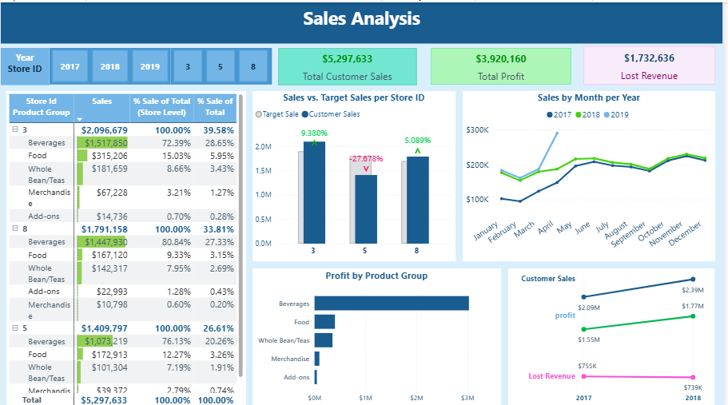

Here you can see page 1 of SalesAnalysis.pbix with several DAX measures for Sales/Profit/Revenue

Page 2 further analyzes Customer Sales by Gender, Product Type, and Store-ID. Moreover five top customers of each store is determined. 

Page 3 depicts Moving Average for Sales and also Customer Sales Month over Month. 
